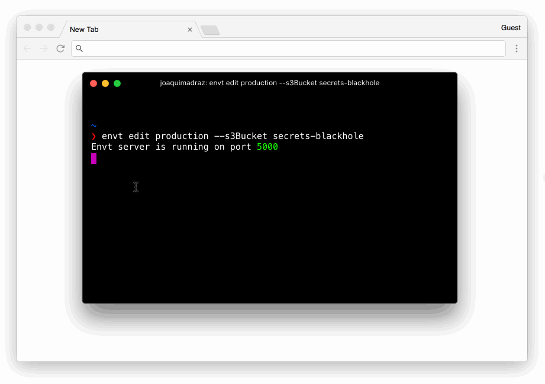

# envt

☁️ Environment variables management from S3

___

**Someone pointed out that AWS has a service for this - [AWS System Manager Parameters](https://docs.aws.amazon.com/systems-manager/latest/userguide/sysman-paramstore-about.html) - which looks exacly what I was looking for. I'll investigate if it fits my needs before continuing working on this package.**
___
## Requirements
- [AWS CLI](https://aws.amazon.com/cli/) configured or AWS env keys accessible from ENV: 
  - `AWS_ACCESS_KEY_ID`
  - `AWS_SECRET_ACCESS_KEY`
  - `AWS_DEFAULT_REGION`
- AWS S3 Bucket
- `env` folder at the root with the env files inside
- Env files need to follow the naming convention - `env.environment`. e.g. `env.staging`

## Installation
```
npm install -g envt
```

## Usage

<p align="center">

</p>

```
Usage

  $ envt <command> <environment>

  $ envt edit <environment>                     Launch web app to edit environment variables
  $ envt list <environment>                     Print environment variables

Options

  --s3Bucket                                    AWS S3 Bucket where the .env files are stored. It's required.

  --port                                        Port where the web app is runs

  --credentials [awscli, env]                   Where to load AWS credentials from - awscli configuration
                                                or from the environment. If from the environment,
                                                AWS_ACCESS_KEY_ID, AWS_SECRET_ACCESS_KEY and AWS_DEFAULT_REGION
                                                have to be set

Examples

  $ envt edit production --s3Bucket secrets     Downloads env.production file from S3 bucket 'secrets' and
                                                opens web app to edit the variables

  $ envt list development --s3Bucket secrets    List env.development variables from S3 bucket 'secrets'
```

## How to export the environment variables?
```
export $(envt list ENVIRONMENT --s3Bucket BUCKET_NAME)
```

## License
MIT © [Joaquim Adraz](http://joaquimadraz.com)
